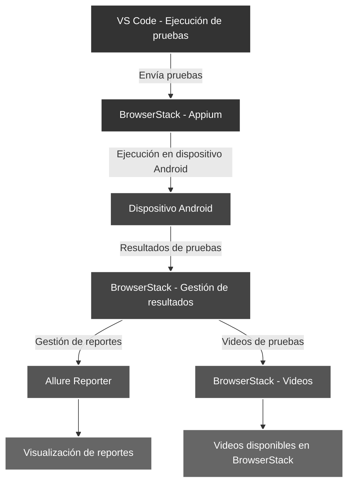
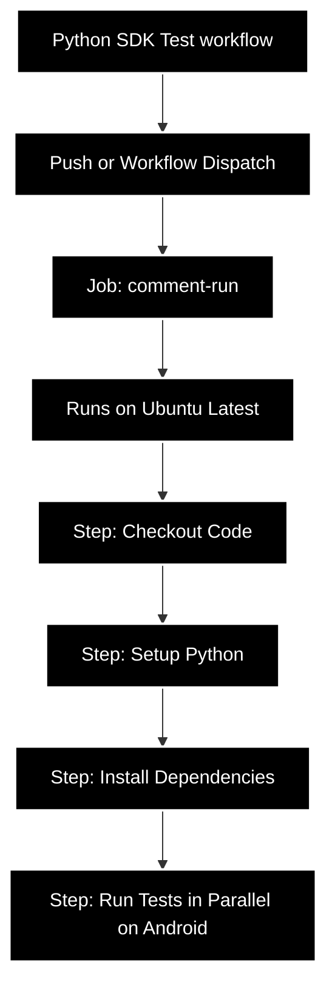

npx wdio config

# UNIVERSIDAD PRIVADA DE TACNA

## Facultad de Ingeniería

## Escuela profesional de Ingeniería de Sistemas

### Proyecto: Juegos Florales

### Pruebas de Aceptación/Interfaz

### Integrantes:

| ID  | Nombres | Apellidos      | Código     |
| --- | ------- | -------------- | ---------- |
| 1   | Jhonny  | Rivera Mendoza | 2020067144 |
| 2   | Ronal Daniel  | Lupaca Mamani  | 20200671.. |

---

### Diagrama de 

### Diagrama del pipeline

