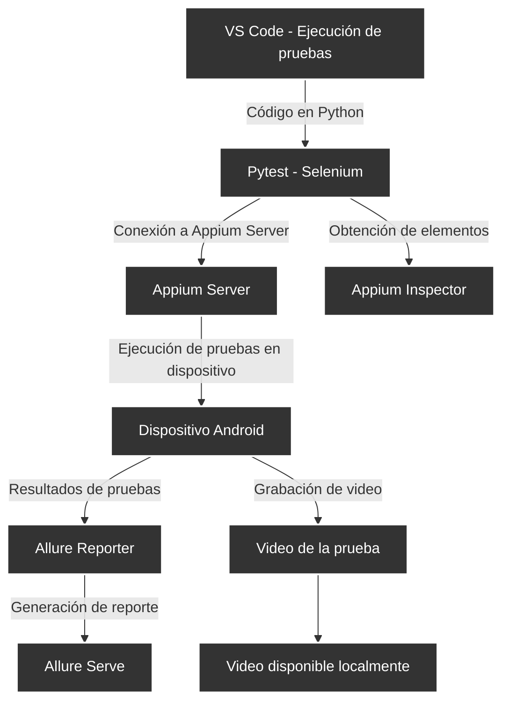
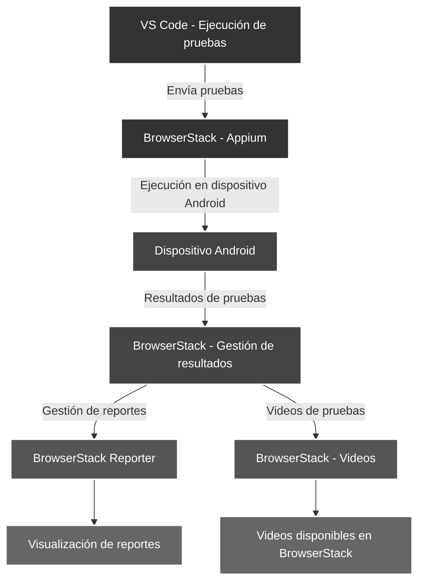
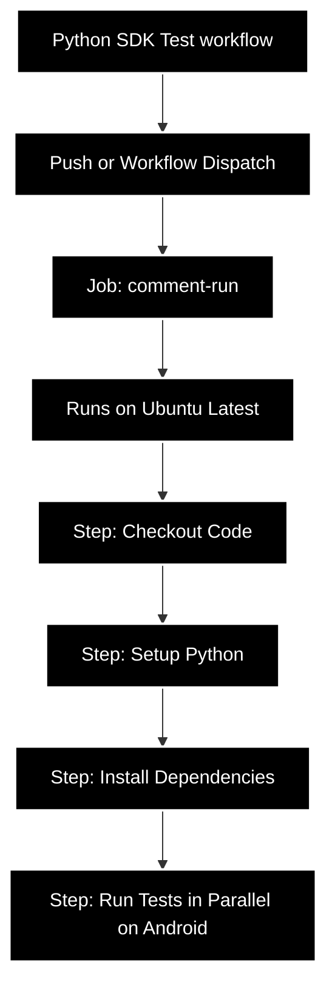

[](https://classroom.github.com/a/vK6WBQ1t)
[](https://classroom.github.com/open-in-codespaces?assignment_repo_id=15560940)

# UNIVERSIDAD PRIVADA DE TACNA

## Facultad de Ingeniería

## Escuela profesional de Ingeniería de Sistemas

### Proyecto: Juegos Florales

### Pruebas de Aceptación/Interfaz

### Integrantes:

| ID  | Nombres      | Apellidos      | Código     |
| --- | ------------ | -------------- | ---------- |
| 1   | Jhonny       | Rivera Mendoza | 2020067144 |
| 2   | Ronal Daniel | Lupaca Mamani  | 20200671.. |

---

### Diagrama de ejecucion de pruebas local



### Diagrama de ejecucion de pruebas usando BrowserStack



### Diagrama del pipeline



# Pruebas a la interfaz de Login

### Reporte

Despliegue con github pages
https://upt-faing-epis.github.io/proyecto-si8811a-2024-ii-u1-pruebas-2-rivera-lupaca/#

## Preparando entorno de pruebas

Enlace a la configuracion:
https://github.com/UPT-FAING-EPIS/proyecto-si8811a-2024-ii-u1-pruebas-2-rivera-lupaca/issues/6

### Requerimientos

- Python
- Appium
- Appium Inspector
- Librerias: Selenium, pytest, allure-pytest, appium-python-client.
- Allure
- Vscode

### Comandos

Instalando las librerias:
Selenium:

```
pip install selenium
```

Para instalar Appium-python

```
pip install appium-Python-Client==2.0.0
```

Instalando allure-pytest

```
pip install allure-pytest
```

Instalando pytest

```
pip install pytest
```

## BrowserStack para pruebas automatizadas

### Clonamos la plantilla

```
git clone https://github.com/browserstack/pytest-appium-app-browserstack
cd pytest-appium-app-browserstack
```

### Creando entorno de trabajo venv

Dentro del repositorio de pruebas

```
python -m venv env
env\Scripts\activate
pip install -r requirements.txt

```

### Configuramos el browserstack.yml

```
userName: <TuUsuario>
accessKey: <TuAccessKey>
framework: pytest
app: bs://sample.app
platforms:
  - platformName: android
    deviceName: Samsung Galaxy S22 Ultra
    platformVersion: 12.0
  - platformName: android
    deviceName: Google Pixel 7 Pro
    platformVersion: 13.0
  - platformName: android
    deviceName: OnePlus 9
    platformVersion: 11.0
parallelsPerPlatform: 1
browserstackLocal: true
buildName: browserstack-build-1
projectName: BrowserStack Sample
```

### Ejecutamos la prueba

```
cd android
browserstack-sdk pytest -s bstack_sample.py
```

## Resultados


## Imagenes


